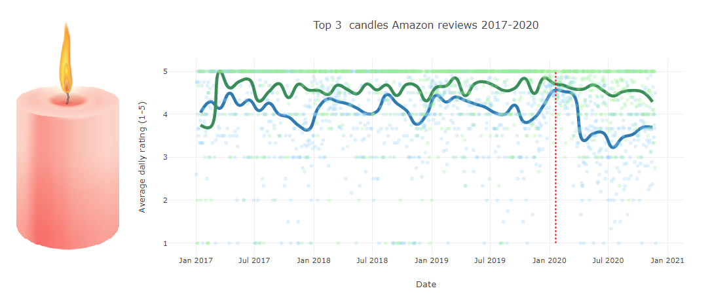
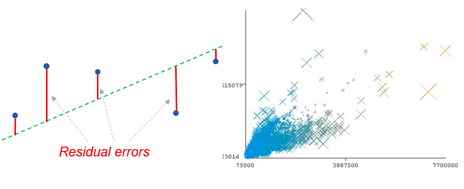
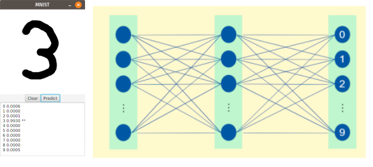

<!--
SPDX-License-Identifier: Apache-2.0

Licensed under the Apache License, Version 2.0 (the "License");
you may not use this file except in compliance with the License.
You may obtain a copy of the License at

    https://www.apache.org/licenses/LICENSE-2.0

Unless required by applicable law or agreed to in writing, software
distributed under the License is distributed on an "AS IS" BASIS,
WITHOUT WARRANTIES OR CONDITIONS OF ANY KIND, either express or implied.
See the License for the specific language governing permissions and
limitations under the License.
-->

# Data Science with Groovy

Groovy is a powerful multi-paradigm programming language for the JVM that offers a wealth of features that make it ideal for many data science and big data scenarios.

* Groovy has a dynamic nature like Python, which means that it is very powerful, easy to learn, and productive. The language gets out of the way and lets data scientists write their algorithms naturally.

* Groovy has a static nature like Java and Kotlin, which makes it fast when needed. Its close alignment with Java means that you can often just cut-and-paste the Java examples from various big data solutions and they’ll work just fine in Groovy.

* Groovy has first-class functional support, meaning that it offers features and allows solutions similar to Scala. Functional and stream processing with immutable data structures can offer many advantages when working in parallel processing or clustered environments.

This repo has examples of using Groovy with various Data Science and related libraries.

Topics covered include:

* Dataframes and visualization
* Linear regression
* Clustering
* Natural language processing
* Neural networks

You have 4 options to run many of the examples:

* [running locally](docs/RunningLocal.md) on the command-line or in an IDE
* [running via gitpod](docs/RunningGitpod.md)
* [running as a Jupyter/BeakerX](docs/RunningBeakerX.md) notebook
* [running in the Groovy Console or Groovy Web Console](docs/RunningConsole.md)

### Scented candles and COVID-19

When we hypothesize about a trend,
it can be interesting to see whether any data backs up our hypothesis.
To do that, we want to be able to easily obtain data in a form we can
analyse and visualize. This example illustrates doing just that.

All the details can be found in the [Candles subproject](subprojects/Candles/).
Options are available to run the examples on the command-line or in your favourite IDE.

| | Technologies/libraries covered |
| --- | --- |
| Data manipulation | [Tablesaw] |
| Visualization | [Tablesaw Plot.ly] |
| Aspects covered | Reading xlsx, dataframes, visualization |

### House price prediction with linear regression

Linear regression will enable us to find a "best fit" linear relationship between some properties or features of interest.
Ordinary least squares finds such a relationship by minimising residual errors.
This example uses linear regression to explore predicting house prices from a number
of other features such as number of bedrooms, number of bathrooms,
living space etc.
The examples illustrate several alternative dataframe libraries,
several CVS handling libraries, and a number of visualization options.

All the details can be found in the [HousePrices subproject](subprojects/HousePrices/).
Options are available to run the examples on the command-line, in your favourite IDE, using Gitpod,
or using a Jupyter/BeakerX notebook.

| | Technologies/libraries covered |
| --- | --- |
| Data manipulation | [Tablesaw], [Joinery], [Apache Commons CSV], [OpenCSV] |
| Regression, math | [Smile], [Apache Commons Math], [Weka] |
| Visualization | [GroovyFX], [XChart], [Tablesaw Plot.ly] |
| Scaling regression | [Apache Ignite], [Apache Spark], [Apache Beam], [GPars] |
| Aspects covered | Reading csv, dataframes, visualization, exploration, errors, outliers, single and multi linear regression |

### Whiskey clustering with K-means

K-means is the most common form of “centroid” clustering.
Unlike classification, clustering is an unsupervised learning method.
The categories are not predetermined but instead represent natural groupings
which are found as part of the clustering process.
Members of each cluster should be similar to each other and
different from the members of the other clusters.
The K represents the number of clusters to find.
This example uses K-means to look at grouping together
similar Whiskey drinks from various distilleries.

All the details can be found in the [Whiskey subproject](subprojects/Whiskey/).
Options are available to run the examples on the command-line, in your favourite IDE, using Gitpod,
or using a Jupyter/BeakerX notebook.

| | Technologies/libraries covered |
| --- | --- |
| Data manipulation | [Tablesaw], [Datumbox], [Apache Commons CSV] |
| Clustering | [Smile], [Apache Commons Math], [Datumbox], [Weka], [Encog], [Elki] |
| Visualization | [XChart], [Tablesaw Plot.ly], [Smile visualization], [JFreeChart] |
| Scaling clustering | [Apache Ignite], [Apache Spark], [Rheem] |
| Main aspects/algorithms covered | Reading csv, dataframes, visualization, exploration, KMeans, PCA, hierarchical clustering, centroids |
| Other aspects/algorithms covered | XMeans, GMeans, cascade KMeans, Cobweb, Learning Vector Quantization (LVQ), GenClustPlusPlus, SelfOrganizingMap (SOM) |

### Natural language processing

Natural language processing may involve language detection, parsing, part-of-speech tagging and other activities.

All the details can be found in the [LanguageProcessing](subprojects/LanguageProcessing/) subproject.
Options are available to run the examples on the command-line, in your favourite IDE, using Gitpod,
or using a Jupyter/BeakerX notebook.

| | Technologies/libraries covered |
| --- | --- |
| NLP | [Apache OpenNLP], [Smile] |
| Scaling NLP | [Apache NLPCraft] |
| Aspects covered | Language detection, sentence detection, named entity detection, parts-of-speech detection |

### Digit recognition using neural networks

An artificial neural network consists of layers of nodes which talk to other nodes based on weights and thresholds.
It mimics to some degree the way in which neurons are interconnected in biological neural networks.
Neural networks are particularly good when some degree of fuzziness is required in the processing activity.
They are popular for speech and image recognition and medical diagnosis among other areas.
This example looks at using neural networks for digit recognition.

More details can be found in the [Mnist](subprojects/Mnist/) subproject.
It contains examples using hand-written neural networks with
[Apache Commons Math] used for matrix calculations
and multilayer perceptron examples using
[Deep Learning4J].

| | Technologies/libraries covered |
| --- | --- |
| Neural networks | [Apache Commons Math], [Deep Learning4J] |

### Deep-learning with Apache MXNet

Neural networks with numerous layers of nodes allow for more complex, rich and _deeper_ processing and understanding.
This example detects objects within an image.
It uses a pre-trained model and the
[Apache MXNet] (incubating) library.

More details can be found in the [DeepLearningMxnet](subprojects/DeepLearningMxnet/) subproject.

| | Technologies/libraries covered |
| --- | --- |
| Image detection | [Apache MXNet] |

---

## Related examples

### Diet optimization

Optimization algorithms aren't exclusively related just to data science but
never-the-less can crop up quite often. This case study looks at using linear programming
to optimize a diet problem. Given the cost and nutrition values of various
foods, can we minimise the cost of a diet but still meet various
health requirements for the diet.

Details can be found in the related website: [groovy-constraint-programming/Diet](https://github.com/paulk-asert/groovy-constraint-programming/tree/master/subprojects/Diet)

| | Technologies/libraries covered |
| --- | --- |
| Constraint-programming, Linear programming | [Apache Commons Math], [Choco], [JaCoP], [Ojalgo], [OptaPlanner], [OrTools], [SAS/OR] |

---

### Cryptarithmetic puzzle with constraint programming

While not often spoken about as a classic data science technique,
constraint programming can be a very useful tool in numerous scenarios.
It allows users to specify characteristics of a problem as high-level constraints
and then invoke a solution engine which will apply back-tracking,
constraint propagation and perhaps heuristics to find a solution matching the constraints.
This example solves a classic cryptarithmetic puzzle using constraint programming.
The Groovy solution is contrasted with brute-force approaches and solutions in other JVM languages.

Details can be found in the related website: [groovy-constraint-programming/SendMoreMoney](https://github.com/paulk-asert/groovy-constraint-programming/tree/master/subprojects/SendMoreMoney)

| | Technologies/libraries covered |
| --- | --- |
| Constraint-programming | [Choco] |
| Programming language | [Clojure], [Groovy], [Frege], [Java], [Nashorn], [JRuby], [Jython], [Kotlin], [Luaj], [Scala], [tuprolog] |

---

__Requirements__:
* Most examples have been tested with at least JDK8 and JDK11.
  Examples which run with JDK11, typically also work with later JDK versions.
  Some examples have more specific requirements, e.g. JDK8 with JavaFX or JDK11+ only.
  Such requirements are noted in the specific README docs for each subproject.

[Weka]: https://www.cs.waikato.ac.nz/ml/weka/
[Smile]: http://haifengl.github.io/
[Datumbox]: https://github.com/datumbox/datumbox-framework
[Elki]: https://elki-project.github.io/
[Encog]: https://github.com/jeffheaton/encog-java-core
[Jupyter/BeakerX]: http://beakerx.com/ "Jupyter/BeakerX notebooks"
[Tablesaw]: https://tablesaw.tech/
[Joinery]: https://cardillo.github.io/joinery
[Apache OpenNLP]: https://opennlp.apache.org/
[Deep Learning4J]: https://deeplearning4j.org/
[Choco]: http://www.choco-solver.org/
[Apache Spark]: https://spark.apache.org/
[Apache Ignite]: https://ignite.apache.org/
[Apache MXNet]: https://mxnet.apache.org/
[GPars]: http://gpars.org/
[Apache Beam]: https://beam.apache.org/
[Apache NLPCraft]: https://nlpcraft.apache.org/
[Tablesaw Plot.ly]: https://jtablesaw.github.io/tablesaw/userguide/Introduction_to_Plotting.html "Tablesaw Plot.ly support"
[Smile visualization]: http://haifengl.github.io/visualization.html
[JFreeChart]: http://www.jfree.org/jfreechart/
[XChart]: https://knowm.org/open-source/xchart/
[GroovyFX]: http://groovyfx.org/
[OpenCSV]: http://opencsv.sourceforge.net/
[Apache Commons CSV]: https://commons.apache.org/proper/commons-csv/
[Apache Commons Math]: https://commons.apache.org/proper/commons-math/
[Clojure]: https://clojure.org/
[Groovy]: https://groovy-lang.org/
[Frege]: https://github.com/Frege/frege "JVM Haskell"
[Java]: https://www.java.com/
[Nashorn]: https://docs.oracle.com/javase/10/nashorn/ "JavaScript for JVM up to JDK"
[JRuby]: https://www.jruby.org/ "Ruby for the JVM"
[Jython]: https://www.jython.org/ "Python for the JVM"
[Kotlin]: https://kotlinlang.org/
[Luaj]: https://github.com/luaj/luaj "LUA for the JVM"
[Scala]: https://www.scala-lang.org/
[tuprolog]: http://apice.unibo.it/xwiki/bin/view/Tuprolog/ "A prolog for the JVM"
[Ojalgo]: https://www.ojalgo.org/
[JaCoP]: https://github.com/radsz/jacop
[OptaPlanner]: https://www.optaplanner.org/
[OrTools]: https://developers.google.com/optimization "Google OR Tools"
[SAS/OR]: https://www.sas.com/en_us/software/or.html
[Rheem]: https://rheem-ecosystem.github.io/
