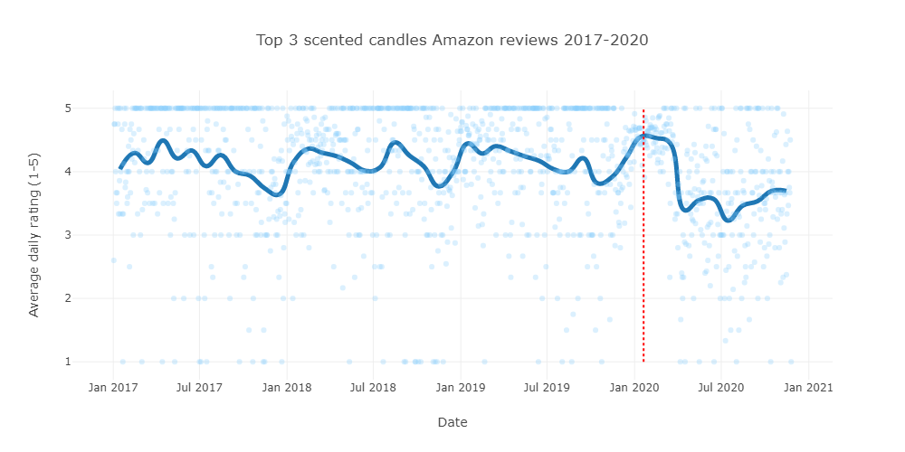
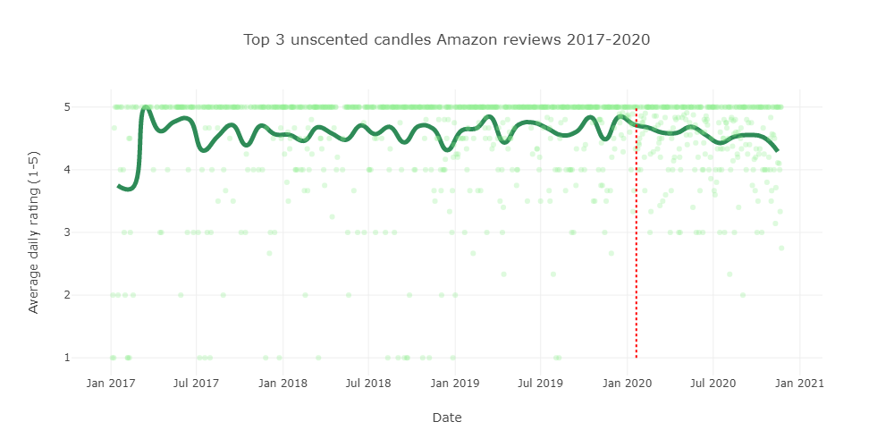

<!--
SPDX-License-Identifier: Apache-2.0

Licensed under the Apache License, Version 2.0 (the "License");
you may not use this file except in compliance with the License.
You may obtain a copy of the License at

    https://www.apache.org/licenses/LICENSE-2.0

Unless required by applicable law or agreed to in writing, software
distributed under the License is distributed on an "AS IS" BASIS,
WITHOUT WARRANTIES OR CONDITIONS OF ANY KIND, either express or implied.
See the License for the specific language governing permissions and
limitations under the License.
-->

# Scented Candles meets COVID-19

An interesting tweet popped into my twitter feed while preparing this workshop:


It was interesting not solely because the topic is one that interests many of us
right now. It is interesting because when we hypothesize about a trend,
it can be interesting to see whether any data backs up our hypothesis.
To do that, we want to be able to easily obtain data in a form we can
analyse and visualize. That's what this example shows off.
It's my variation of the nice work mentioned in the original tweet.
Those interested may wish to look at the original
[tweet](https://twitter.com/kate_ptrv/status/1332398737604431874) and
[repo](https://github.com/kateptrv/Candles).

Groovy code examples can be found in the [src/main/groovy](src/main/groovy) directory.

The example uses the [Tablesaw](https://tablesaw.tech/) dataframe and visualization library.
Instead of following the lead of the original example which uses a `geom_smooth` plotting
capability within the used R library, I rolled my own monthly average ratings and plotted that
along with the daily average ratings for scented:



and unscented candles:



Analysing the reviews of the top 5 scented candles to see which ones mention no scent
yields the following graph:


## Running the examples

These examples are currently set up to run locally, either in your IDE or via the command-line using Gradle.

Command-line arguments for Gradle to see the task names for running the Groovy scripts (use `./gradlew` on Unix-like systems):
```
gradlew :Candles:tasks --group="Application"
```

Alternatively, you can use a Jupyter/Beakerx notebook:
[](https://mybinder.org/v2/gh/paulk-asert/groovy-data-science/master?filepath=subprojects%2FCandles%2Fsrc%2Fmain%2Fnotebook%2FCandles.ipynb)

__Requirements__:
* Examples should run fine in JDK8, JDK11 or JDK17.
* These examples use Tablesaw Plot.ly integration which opens in a browser. These will give an error if run
  using Gitpod but will create a file in the `build` folder which you can then open by right-clicking in the
  Gitpod browser then "Open With -> Preview".
