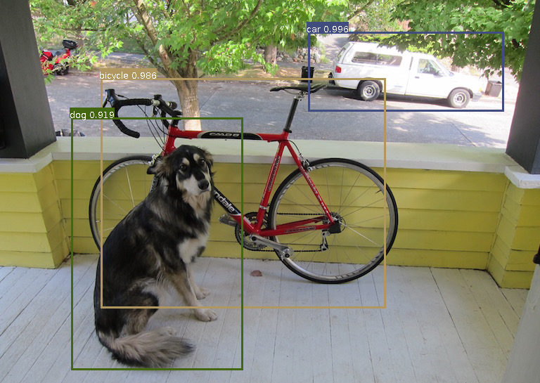

<!--
SPDX-License-Identifier: Apache-2.0

Licensed under the Apache License, Version 2.0 (the "License");
you may not use this file except in compliance with the License.
You may obtain a copy of the License at

    https://www.apache.org/licenses/LICENSE-2.0

Unless required by applicable law or agreed to in writing, software
distributed under the License is distributed on an "AS IS" BASIS,
WITHOUT WARRANTIES OR CONDITIONS OF ANY KIND, either express or implied.
See the License for the specific language governing permissions and
limitations under the License.
-->

# Deep-learning with Apache MXNet

Neural networks with numerous layers of nodes allow for more complex, rich and _deeper_ processing and understanding.
This example detects objects within an image.
It uses a pre-trained model and the
[Apache MXNet](https://mxnet.apache.org/)
library.

Groovy code examples can be found in the [DeepLearningMxnet](subprojects/DeepLearningMxnet/src/main/groovy) subproject.
If you have opened the repo in IntelliJ (or your favourite IDE) you should be able to execute the examples directly in the IDE.

__Requirements__: Unfortunately the MXNet Java Inference API (which is what our Groovy script is using)
currently has issues running in Windows. The Scala API has the same issue.
Avoid the Windows platform for this example for now.
